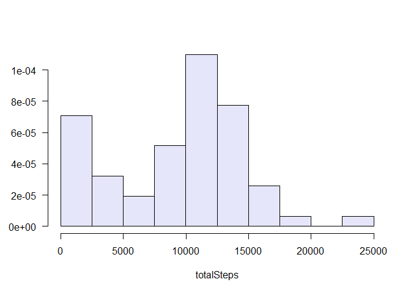
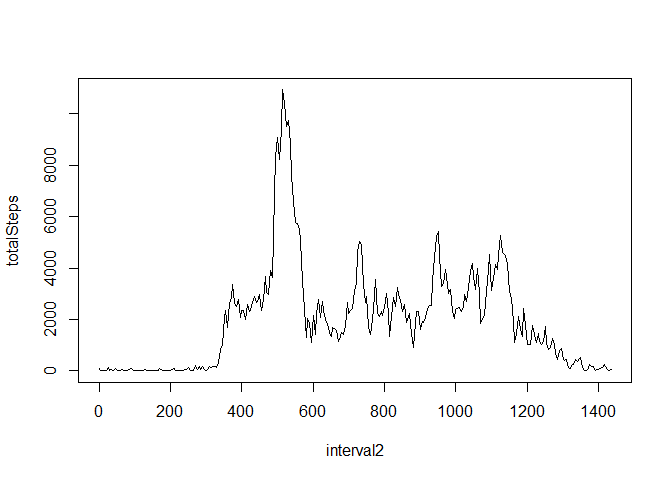
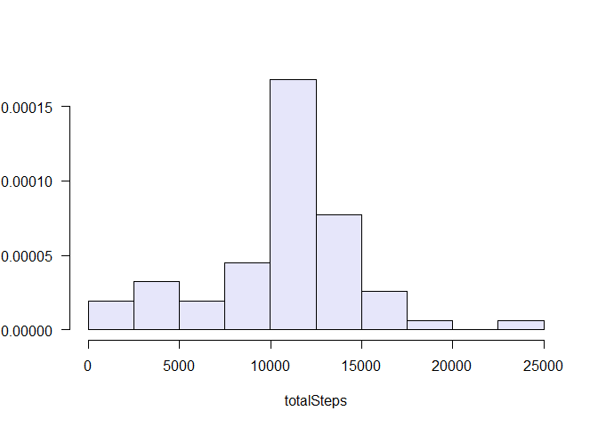
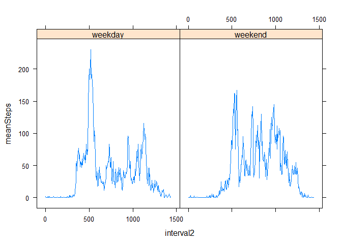

# Reproducible Research: Course Project 1
Mike Blakeney  
April 16, 2017  


## Loading and preprocessing the data


```r
setwd("C:\\Users\\mblakeney\\RepData_PeerAssessment1")
library(dplyr)
```

```
## 
## Attaching package: 'dplyr'
```

```
## The following objects are masked from 'package:stats':
## 
##     filter, lag
```

```
## The following objects are masked from 'package:base':
## 
##     intersect, setdiff, setequal, union
```

```r
library(tidyr)
```

```
## Warning: package 'tidyr' was built under R version 3.3.3
```

```r
library(MASS)
```

```
## 
## Attaching package: 'MASS'
```

```
## The following object is masked from 'package:dplyr':
## 
##     select
```

```r
library(lattice)
```

```
## Warning: package 'lattice' was built under R version 3.3.3
```


```r
activity <- read.csv("activity.csv")
activity <- mutate(activity, 
                   hour=trunc(interval/100,0), 
                   minute=interval%%100,
                   interval2 = 60*hour + minute,
                   timestamp = as.POSIXct(date)+3600*hour+60*minute,
                   date2 = as.Date(timestamp))

activity_by_date <- group_by(activity, date2)
activity_by_time <- group_by(activity, interval2)
```

## What is the mean total number of steps taken per day?

*(For this part of the assignment, we ignore the missing values in the dataset)*

1. *Calculate the total number of steps taken per day*
2. *Make a histogram of the total number of steps taken each day*


```r
steps_by_date <- summarise(activity_by_date, totalSteps = sum(steps, na.rm = TRUE))
with(steps_by_date,truehist(totalSteps, col="lavender", las=1, h=2500))
```

<!-- -->

3. *Calculate and report the mean and median of the total number of steps taken per day*


```r
mean(steps_by_date$totalSteps)
```

```
## [1] 9203.355
```

```r
median(steps_by_date$totalSteps)
```

```
## [1] 10490.5
```

## What is the average daily activity pattern?

1. *Make a time series plot of the 5-minute interval (x-axis) and the average number of steps taken, averaged across all days (y-axis)*


```r
steps_by_time <- summarise(activity_by_time, totalSteps = sum(steps, na.rm = TRUE))
plot(steps_by_time, type = 'l')
```

<!-- -->

2. *Which 5-minute interval, on average across all the days in the dataset, contains the maximum number of steps?*


```r
steps_by_time[which.max(steps_by_time$totalSteps),]
```

```
## # A tibble: 1 × 2
##   interval2 totalSteps
##       <dbl>      <int>
## 1       515      10927
```

Note that I have re-coded the time intervals to represent the number of minutes since midnight, so interval 515 here represents 8:35 AM to 8:40 AM.

## Imputing missing values

*Note that there are a number of days/intervals where there are missing values (coded as NA). The presence of missing days may introduce bias into some calculations or summaries of the data.*

1. *Calculate and report the total number of missing values in the dataset (i.e. the total number of rows with NAs)*


```r
sum(is.na(activity$steps))
```

```
## [1] 2304
```

2. *Devise a strategy for filling in all of the missing values in the dataset.*

Keeping it simple, as suggested. I'm just taking the mean number of steps (excluding `NAs`) for each 5-minute interval, and imputing that value for any `NAs` in that interval.


```r
mean_steps_by_time <- summarise(activity_by_time, meanSteps = mean(steps, na.rm = TRUE))
```

3. *Create a new dataset that is equal to the original dataset but with the missing data filled in.*


```r
activity <- activity %>%
    left_join(mean_steps_by_time) %>%
    mutate(steps=ifelse(is.na(steps),meanSteps,steps))
```

```
## Joining, by = "interval2"
```

```r
sum(is.na(activity$steps)) ## should be zero if the imputation worked
```

```
## [1] 0
```

4. *Make a histogram of the total number of steps taken each day and Calculate and report the mean and median total number of steps taken per day. Do these values differ from the estimates from the first part of the assignment? What is the impact of imputing missing data on the estimates of the total daily number of steps?*


```r
activity_by_date <- group_by(activity, date2)
steps_by_date <- summarise(activity_by_date, totalSteps = sum(steps, na.rm = TRUE))
with(steps_by_date,truehist(totalSteps, col="lavender", las=1, h=2500))
```

<!-- -->

```r
mean(steps_by_date$totalSteps)
```

```
## [1] 10592.54
```

```r
median(steps_by_date$totalSteps)
```

```
## [1] 10559.5
```

Clearly the imputation process has resulted in a much more *centered* distribution of steps by day. It seems that the peak of days with under 5,000 steps that appeared in the earlier histogram was an artifact of the large number of `NAs` in the original datafile. Also, the mean and median values are slightly higher than before.

## Are there differences in activity patterns between weekdays and weekends?

1. *Create a new factor variable in the dataset with two levels - "weekday" and "weekend" indicating whether a given date is a weekday or weekend day.*


```r
activity <- activity %>%
    mutate(wkday = as.factor(weekdays(date2))) %>%
    mutate(wkday = ifelse(wkday == "Saturday" | wkday == "Sunday", "weekend", "weekday"))
```

2. *Make a panel plot containing a time series plot of the 5-minute interval (x-axis) and the average number of steps taken, averaged across all weekday days or weekend days (y-axis).*


```r
activity_by_time_weekday <- group_by(activity, interval2, wkday)
steps_by_time_weekday <- summarise(activity_by_time_weekday, meanSteps = mean(steps, na.rm = TRUE))
xyplot(meanSteps ~ interval2 | factor(wkday), data=steps_by_time_weekday, type="l")
```

<!-- -->
